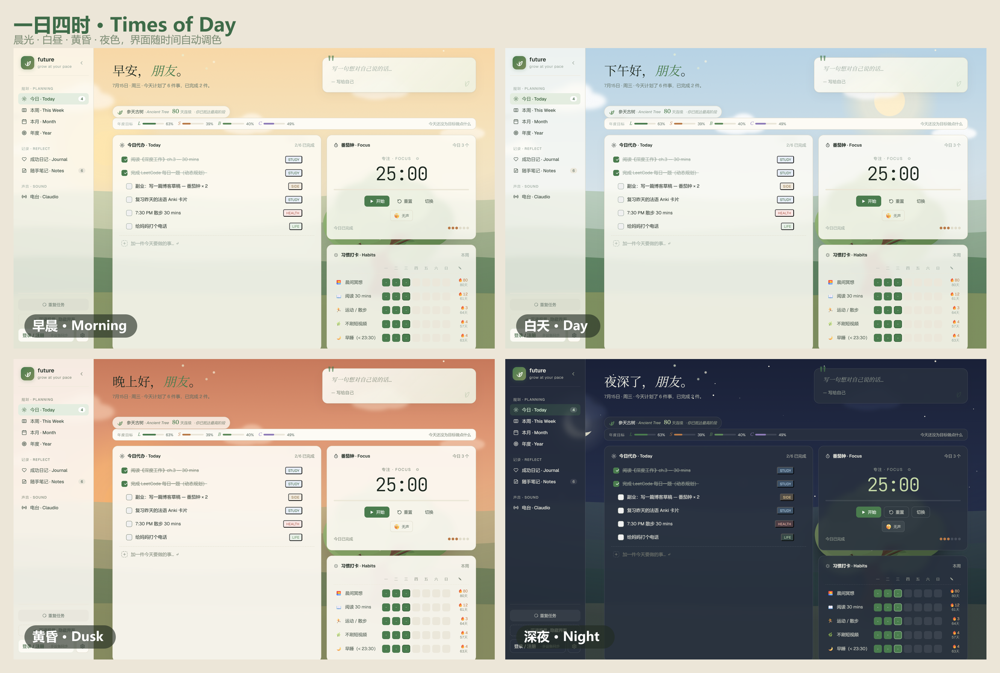
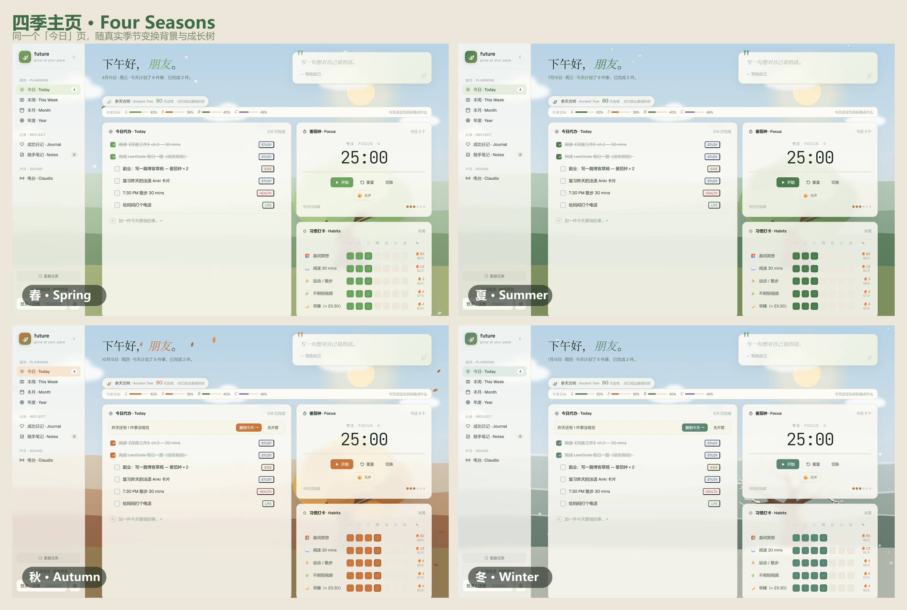
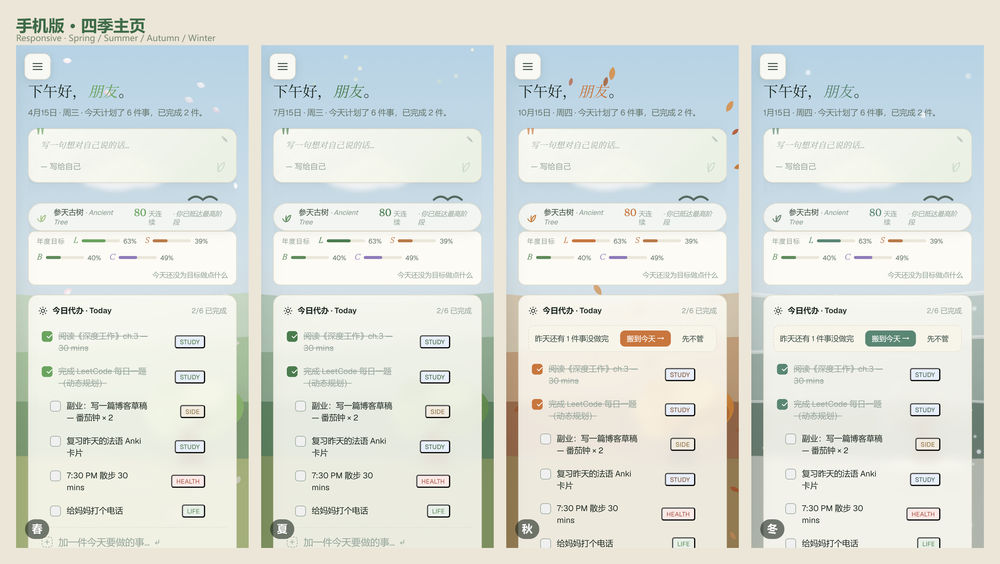

# future.v2 — 学习规划 app

一个中文为主的个人成长 / 学习规划 web app。把「今日待办、周月年规划、习惯打卡、番茄钟、
复盘记录」收进一个安静好看的单页应用里，配上四季成长树背景和一个会放歌的 AI 电台 Claudio。

数据默认存在浏览器本地（localStorage），可选接入 Supabase 做多端云同步。纯前端可独立部署到
Cloudflare Pages / Netlify；Claudio 电台是可选的自托管增强，需要本机跑一个 Node 中枢。

## 📸 界面预览









## ✨ 功能一览

- **今日待办** —— 当天任务管理，可把待办挂靠到 OKR 关键结果上
- **规划** —— 周 / 月 / 年三级规划，历史记录并入翻页浏览
- **习惯打卡** —— 习惯养成与连续天数追踪
- **番茄钟** —— 基于真实时间戳（`endAt`）的计时，切后台 / 锁屏不跑偏
- **复盘** —— 五件好事、成功日记、随手笔记（朋友圈式时间线）
- **OKR** —— 目标与关键结果，待办可关联
- **成长树** —— 四季变换的成长树背景，随积累升阶（stage 0–5）+ 升阶动画
- **Claudio AI 电台** —— spawn 本机 Claude Code CLI 当「大脑」，MiniMax 做 TTS 的个人电台
- **其它** —— 自定义头像、中英 i18n、本地通知 + Web Push、PWA 离线、Sentry 错误上报

## 🏗️ 架构

2026-06 从「浏览器内 Babel」迁移到 Vite 构建。

| 层 | 说明 |
|---|---|
| 构建 | **Vite** + `@vitejs/plugin-react`，源码 `src/`，静态资源 `public/assets/`，产物 `dist/` |
| 字体 | `@fontsource` 自托管，无 Google Fonts / CDN 依赖（离线、国内可用） |
| 源码组织 | 每个模块用 ESM `import`/`export` 显式声明依赖；同时保留 `Object.assign(window, …)` 兼容层（渲染期仍有大量 `window.X` 引用）。`src/main.jsx` 按固定顺序导入全部模块 |
| 数据 | localStorage（键 `study_planner_v2`）+ 可选 Supabase 云同步（`src/sync.jsx`，实体级合并、删除不传播、覆盖前自动本地备份） |
| 错误监控 | Sentry（`src/sentry.js`）+ 全局 error boundary |
| 框架 | React 18 |

> `legacy-prebuild/` 是迁移前的存档，仅供参考，**不要再改它**。

## 🚀 快速开始

前置：Node.js（建议 18+）。

```bash
npm install        # 安装依赖
npm run dev        # 开发模式，热更新，http://localhost:5173，/api 等代理到 3000
```

Windows 下也可以直接双击根目录的 `.bat`：

| 操作 | 命令 | 批处理 |
|---|---|---|
| 开发（热更新，5173） | `npm run dev` | `开发模式.bat` |
| 构建到 `dist/` | `npm run build` | `构建网页.bat` |
| 本地预览构建产物 | `npm run preview` | — |
| 跨文件引用检查（no-undef） | `npm run lint` | — |
| 单元测试（日期 / 合并 / i18n） | `npm test` | — |
| 启动 Claudio 中枢 + 本地站点 | — | `启动Claudio.bat` |

> **改完 `src/` 必须重新 `npm run build`**，否则 `localhost:3000` / Cloudflare 上看到的还是旧版
> （开发期用 `npm run dev` 则不用）。
>
> 改动跨文件标识符后跑 `npm run lint` —— 它能抓住漏 `import` 的引用（含 JSX 组件位）。

## ☁️ 部署（Cloudflare Pages）

部署 = 上传 `dist/` 目录。

1. `npm run build` 生成 `dist/`
2. Cloudflare Pages → Direct Upload，把 `dist/` 拖上去
   （或 `npx wrangler pages deploy dist`）

新增静态文件放 `public/assets/`，代码里用 `assets/...` 相对路径引用。

## 📻 Claudio AI 电台（可选，自托管）

代码在 `claudio/server/`（Express，端口 **3000**）。

- **大脑** —— spawn 本机 Claude Code CLI（走 Pro 订阅，**无需 API key**）
- **TTS** —— MiniMax（key 放在 `claudio/server/config.local.json`，**勿提交**；参考 `config.example.json`）
- **托管** —— 中枢同时静态托管 `dist/`（见 `claudio/server/config.js` 的 `paths.web`，dist 缺失时回退仓库根）

启动后开 <http://localhost:3000>。Claudio 依赖本机环境（CLI + 放歌），是「完体」体验，
公网纯浏览器版不含它。

## 🔔 Web Push / 云同步配置

- Supabase 配置在 `src/supabase-config.js`
- Web Push 服务端（Supabase Edge Function）部署步骤见 `supabase/WEB_PUSH_SETUP.md`
- 相关 SQL：`supabase/push_subscriptions.sql`、`supabase/delete_user.sql`

## 📁 目录结构

```
future.v2/
├── src/                  前端源码（ESM 模块）
│   ├── main.jsx          入口：字体 + 样式 + 按序导入全部模块
│   ├── app.jsx           顶层 App / Views 路由表
│   ├── view-*.jsx        各页面（today / planning / reflect / radio）
│   ├── store.jsx         状态
│   ├── sync.jsx          Supabase 云同步
│   ├── growth-tree / tree / background-scene / seasons  成长树与四季背景
│   ├── notify.js / push.js / pomo-alert.js             通知与番茄钟提醒
│   └── i18n.js           中英文案
├── public/assets/        静态资源（代码里用 assets/... 引用）
├── dist/                 构建产物（部署上传这个目录）
├── claudio/server/       Claudio 电台中枢（Express）
├── supabase/             云同步 / Web Push 的 SQL 与文档
├── tests/                单元测试（dates / merge / i18n）
├── legacy-prebuild/      迁移前存档（只读，勿改）
├── vite.config.js
└── CLAUDE.md             给 Claude Code 的项目说明
```

## ⚠️ 约定与坑

- 番茄钟 / 计时逻辑依赖真实时间戳（`endAt`），**不要**改成 `setInterval` 减数
- 别提交任何 key：`claudio/server/config.local.json`、Supabase 密钥等
- `legacy-prebuild/` 是历史存档，不要再动

## 📄 License

[MIT](LICENSE) © 2026 Claire
